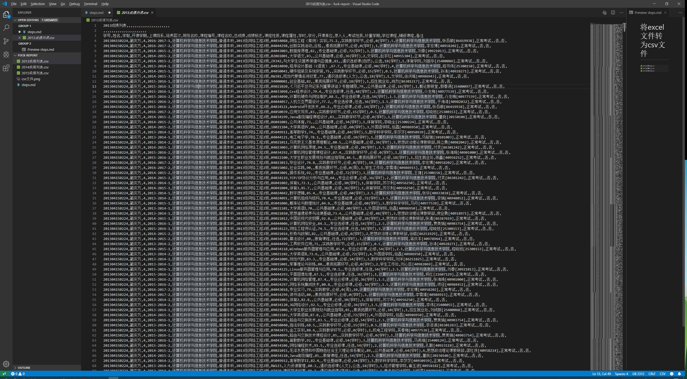

# 将excel文件转为csv文件

* 

* 

* 清除表格标题

# 使用python读取文件

# 要实现的目标
- 可视化成绩分析
    - 以学生为维度，分析各个科目所得学分总和
    - 以学科为维度，分析近三年学科学分
    - 个人层面上，设计程序，挂科学分分析与警示

# JUST FOR PUSH

- 清洗数据
    - 只需要总成绩为数字的数据
    - 学科分析时只考虑正常考试的数据
    - 学分不足提醒功能貌似需要补考，如果挂了的不算，那就不用了，依然还是只考虑正常考试的数据

# 学弟学妹们 请看最终章

- 做的东西
    - 学习成绩的分析，主要三个部分
        - 单科成绩的13 14 15三个年级的平均分 中位数 最高分 最低分 等直方图
        - 三个年级通识选修课内，网络课程修得的学分所占比重
        - 通识选修课，学分警告的逻辑

- 用到的技术
    - python, 编程语言！跨平台!!
    - pandas, 数据分析的python库，好用！作用功能自行百度，本程序用到的技术实属皮毛，要好好学习呦

- 演示过程
    - 装python3
    - cd 项目里 pip3 install -r requirements.txt 安装依赖包
    - python3 exhibition.py 按照提示进行就好
    - ps: 许多print并没有必要可以删掉，提示语言有不规范，自行改正!
    - 再ps: 为了演示不出错误！提前试试哈！

- 项目总开发步骤与程序逻辑
    - 把2013 2014 2015成绩表转为csv保存
    - 程序里有一个clean_data是为了进一步清洗数据，可能程序清洗不是很彻底，所以你们要提前试好
        - 清洗数据的逻辑：把没有分数的总成绩删掉！把缺数据行删掉！把本来也不分析的几个课程性质，考试性质的 对应行 去掉! 把补考去掉，只看正常考试的！
    - single_subject_compare 这个函数 是要 比较单个项目三年几个统计数据的比较
    - general_subject_analysis 这个函数是要 统计 通识选修课 网课学分 三年 占比情况
    - general_subject_credit_warnings 通识选修课 单个人物 警告程序
